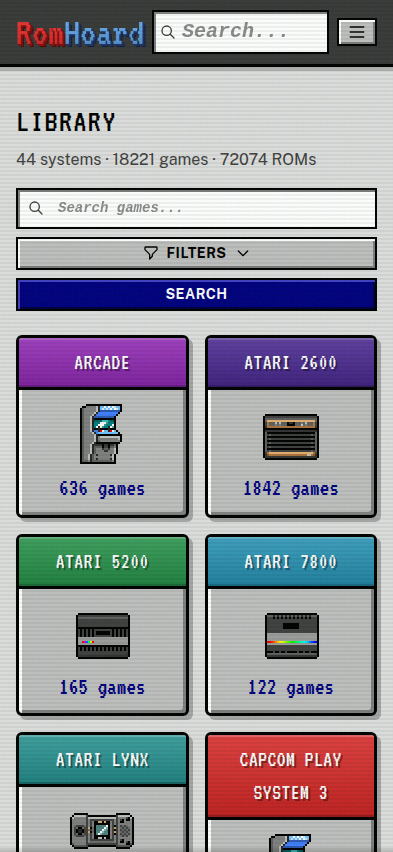
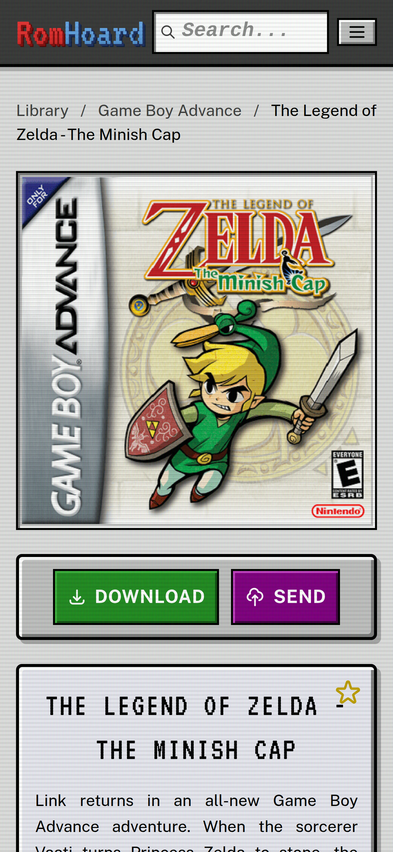
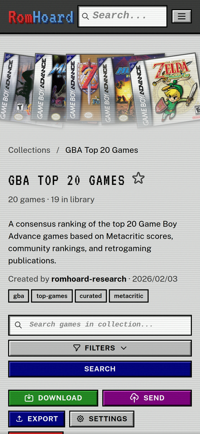
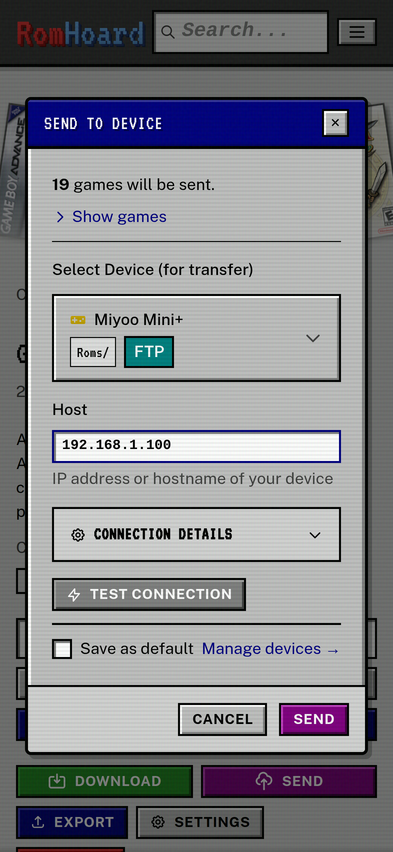

# RomHoard

A self-hosted ROM library manager. Point it at your ROM folders, and it handles the rest: identifies games, fetches metadata and artwork from ScreenScraper, and lets you build collections to send directly to your devices. Discover curated collections from the community or share your own.



## What It Does

- Scans your ROM directories and identifies games automatically
- Fetches cover art, screenshots, and game metadata from ScreenScraper.fr
- Build collections to curate your favorites, top lists, or themed sets
- Browse community collections at [romhoard.cubical.fyi](https://romhoard.cubical.fyi) and import them into your library
- Send collections or individual games to handhelds via FTP/SFTP, with images
- Includes presets for common device OSes (MuOS, KNULLI, Batocera, etc.)



## Collections

Collections are game lists you can share, export, and sync to devices. Create a "Top 20 SNES" list, import someone else's curated RPG picks, or build themed sets for different handhelds. Collections track games by name, so they work even if your ROM files are named differently.



## Collection Hub

Browse and download community-curated collections at [romhoard.cubical.fyi](https://romhoard.cubical.fyi). Find ready-made lists like "Best GBA RPGs" or "Hidden SNES Gems" and import them directly into your library. Collections are just game lists—no ROMs are uploaded or downloaded.

You can also export your own collections and share them with the community. Build something great? Upload it to the hub for others to discover.

## Send to Device

Select games or an entire collection and send them directly to your handheld over FTP or SFTP. RomHoard maps systems to the right folders based on device presets, so ROMs end up where your emulator expects them, with the images.



## Installation

RomHoard runs as a Docker container with PostgreSQL.

### 1. Create a directory for your setup

```bash
mkdir romhoard && cd romhoard
```

### 2. Download the compose file

```bash
curl -O https://raw.githubusercontent.com/cubicalbatch/romhoard/master/docker-compose.yml
```

### 3. Point it at your ROMs

By default, the container looks for ROMs in a `./roms` folder. Edit the compose file to mount your actual ROM directory:

```yaml
volumes:
  - /path/to/your/roms:/roms
```

### 4. Start it up

```bash
docker compose up -d
```

Open http://localhost:6766 in your browser.

## Configuration

Most things are configured through the web UI. For ScreenScraper metadata fetching, you'll need a free account at [screenscraper.fr](https://www.screenscraper.fr/).

See [documentation/docker.md](documentation/docker.md) for environment variables and advanced configuration.

## Why RomHoard?

RomHoard didn't start as a ROM manager. The original idea was to discover and share curated game lists—because having 2000 ROMs and not knowing what to play is a real problem.

Then I wanted to send those collections straight to my retro handhelds. Turns out you need to manage ROMs to do that, so here we are.

### RomHoard vs Romm

[Romm](https://romm.app/) is great if you want to carefully curate your library with metadata from lots of sources.

RomHoard is collections-first: discover curated lists, share your own, and send them to your devices. The ROM management exists to support that.

You can run both—they're good neighbors.

## Tech Stack

Django, PostgreSQL, HTMX, Alpine.js, Tailwind CSS, Procrastinate for background jobs.

## Contributing

Contributions for targeted bug fixes are welcome. For new features, please open an issue to discuss with me first before submitting a pull request.
