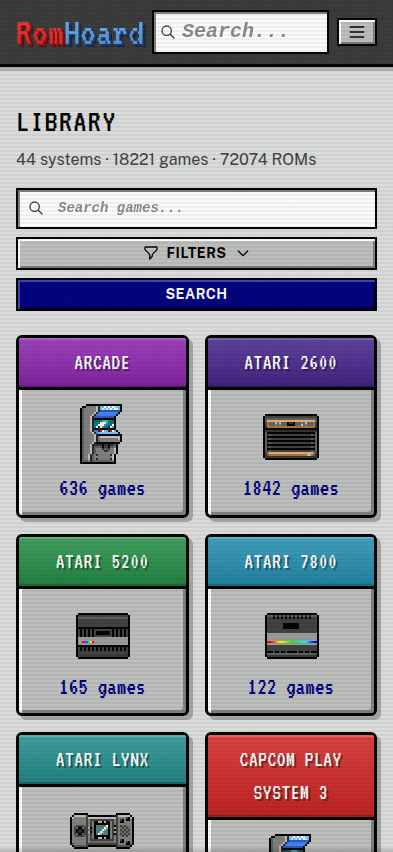
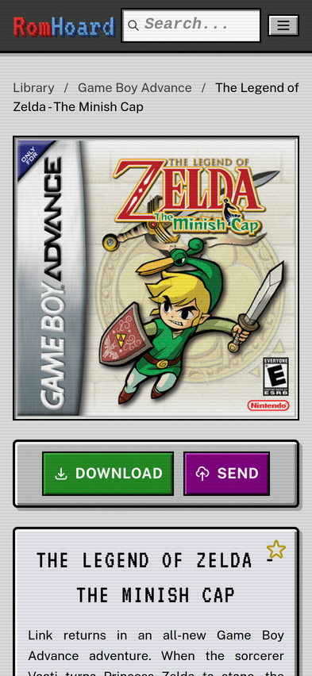
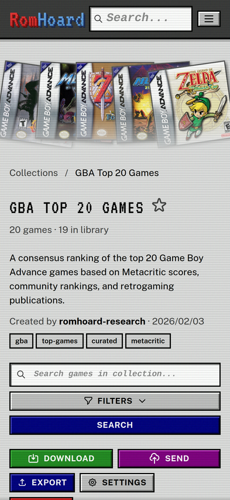
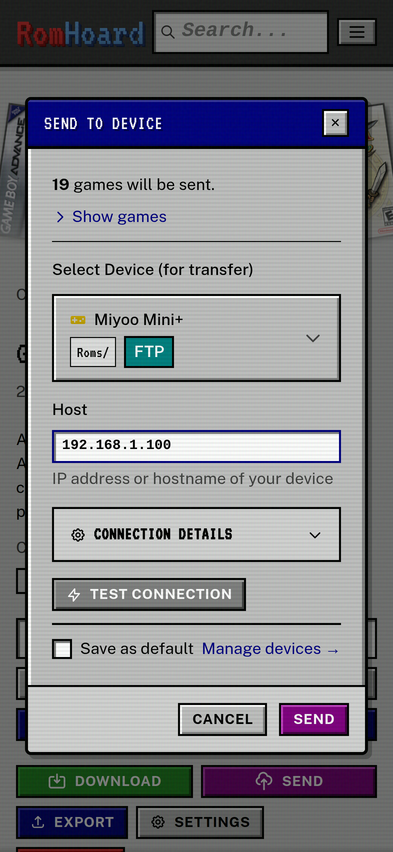

# RomHoard

A self-hosted ROM library manager. Point it at your ROM folders, and it handles the rest: identifies games, fetches metadata and artwork from ScreenScraper, and lets you build collections to send directly to your devices. Discover curated collections from the community or share your own.



## What It Does

- Scans your ROM directories and identifies games automatically
- Fetches cover art, screenshots, and game metadata from ScreenScraper.fr
- Build collections to curate your favorites, top lists, or themed sets
- Browse community collections at [romhoard.cubical.fyi](https://romhoard.cubical.fyi) and import them into your library
- Send collections or individual games to handhelds via FTP/SFTP, with images
- Includes presets for common device OSes (MuOS, KNULLI, Batocera, etc.)



## Collections

Collections are game lists you can share, export, and sync to devices. Create a "Top 20 SNES" list, import someone else's curated RPG picks, or build themed sets for different handhelds. Collections track games by name, so they work even if your ROM files are named differently.



## Collection Hub

Browse and download community-curated collections at [romhoard.cubical.fyi](https://romhoard.cubical.fyi). Find ready-made lists like "Best GBA RPGs" or "Hidden SNES Gems" and import them directly into your library. Collections are just game lists, no ROMs are uploaded or downloaded.

You can also export your own collections and share them with the community. Build something great? Upload it to the hub for others to discover.

## Send to Device

Select games or an entire collection and send them directly to your handheld over FTP or SFTP. RomHoard maps systems to the right folders based on device presets, so ROMs end up where your emulator expects them, with the images.



## Why RomHoard?

RomHoard didn't start as a ROM manager. The original idea was to discover and share curated game lists, because having 2000 ROMs and not knowing what to play is a real problem.

I wanted to send those collections straight to my retro handhelds. Turns out you need to manage ROMs to do that, so here we are.

### RomHoard vs Romm

[Romm](https://romm.app/) is great if you want to carefully curate your library with metadata from lots of sources.

RomHoard is collections-first: discover curated lists, share your own, and send them to your devices. The ROM management exists to support that.

You can run both, they're good neighbors.

## Installation

RomHoard runs as a Docker container with PostgreSQL.

### 1. Create a directory for your setup

```bash
mkdir romhoard && cd romhoard
```

### 2. Download the compose file

```bash
curl -O https://raw.githubusercontent.com/cubicalbatch/romhoard/master/docker-compose.yml
```

### 3. Point it at your ROMs

By default, the container looks for ROMs in a `./roms` folder. Edit the compose file to mount your actual ROM directory:

```yaml
volumes:
  - /path/to/your/roms:/roms
```

### 4. Start it up

```bash
docker compose up -d
```

Open http://localhost:6766 in your browser.

## Troubleshooting ROM identification

From the directory containing your Compose file, create a report to share:

```bash
docker compose exec -T romhoard python manage.py diagnose_roms > romhoard-debug.json
```

For a local installation: `uv run ./manage.py diagnose_roms > romhoard-debug.json`.
The command reads saved scan directories (or `ROM_LIBRARY_ROOT` if none are saved).
Pass a directory to diagnose just that path. It does not rescan, modify the
database, compute hashes, or contact metadata services.

The default report groups files with the same detection outcome, giving a count
and representative fields for each group. It includes stored-versus-predicted
systems, archive outcomes, scan counts, and configuration drift; it excludes
paths, filenames, game titles, hashes, credentials, and raw errors. For every
file's relative path, game title, and stored CRC32/SHA1, add `--details` before
`>` (optionally with a single scan directory to keep the file small). Review
this detailed report before sharing: hashes can identify ROM content. Neither
report uploads itself.

The report describes the **current** detector output only; it contains no
queue, quota, or error-log data.

### How identification works

System detection is folder/filename based and happens before any metadata is
fetched:

- **Folder aliases are explicit and case-insensitive.** Each system in
  `library/systems.json` lists accepted folder names (`folder_names`),
  including No-Intro-style names like `Sega - Genesis - MegaDrive` or
  `SNK - Neo Geo`. The folder component nearest the file decides; a matching
  folder inside an archive is final. If your layout isn't recognized, add an
  alias.
- **A folder that accepts an extension beats another system's exclusive claim
  on it.** `.ipf` under `Atari - ST` is Atari ST (not Amiga), `.tap` under
  `Commodore - C64` is C64 (not ZX Spectrum), `.pce` under
  `NEC - Super Grafx` is SuperGrafx (not PC Engine).
- **Outside a matching folder, only exclusive extensions identify a file.**
  Shared extensions (`.bin`, `.iso`, `.cue`, …) without a matching folder are
  skipped. An exclusive extension still wins inside a folder that can't use
  it: an Xbox 360 `.xex` stays Xbox 360 even inside a PSP folder.
- **Listed non-ROM types never import** — e.g. music dumps like `.spc`, saves,
  docs, and source code. `.md` is both a Mega Drive ROM and Markdown: inside a
  Genesis/Mega Drive folder it is always a ROM; elsewhere a `.md` file on disk
  is a ROM only if it is binary (Markdown READMEs are text).
- **ZIP and 7z archives are opened and their members scanned individually**,
  except archive-as-ROM systems (Neo Geo, arcade, MS-DOS) where the archive
  itself is the game. Archives there that hold only docs, config, or source
  code (emulator INI packs, plugin sources) are skipped.
- **A folder name is a label, not content proof.** Files in the wrong folder
  are imported under that folder's system when the extension fits (an Xbox
  360 `.iso` in a PSP folder becomes a PSP entry), so keep folders accurate.

### Rescans keep the library in sync

Every rescan reconciles stored records with the current detector, so updating
RomHoard and rescanning is all it takes after a detection fix:

- A file now detected as a different system is re-imported under it, with
  fresh metadata. Systems you changed by hand on a game's edit page are kept.
- Records for files that are gone, or that are no longer recognized as ROMs,
  are removed. Games are only deleted once no ROMs remain, so a game with
  variants in several folders keeps its metadata and collection links.
- Files inside archives or folders the scan cannot read are left untouched.

Your ROM files are never modified.

### ScreenScraper limits

ScreenScraper accounts have two daily limits: total requests and requests
that find no match. Both reset at midnight Paris time. When a limit is
reached, RomHoard shows a banner on every page and pauses metadata fetching;
it resumes automatically after the reset, with no rescan or manual fetch
needed. Today's usage is shown under ScreenScraper Credentials on the
Settings page. Large libraries with many unknown files (hacks, demos, TOSEC
sets) can take several days to finish.

## Configuration

Most things are configured through the web UI. For ScreenScraper metadata fetching, you'll need a free account at [screenscraper.fr](https://www.screenscraper.fr/).

See [documentation/docker.md](documentation/docker.md) for environment variables and advanced configuration.

## Tech Stack

Django, PostgreSQL, HTMX, Alpine.js, Tailwind CSS, Procrastinate for background jobs.

## Contributing

Contributions for targeted bug fixes are welcome. For new features, please open an issue to discuss with me first before submitting a pull request.
